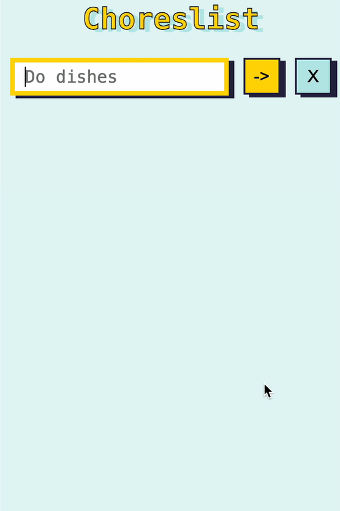

# Choreslist

A simple app for keeping track of chores, built with React. As an added challenge, this app was built using test-driven development(TDD) with Vitest and various React testing libraries.

TDD involves writing the tests first (and having the tests fail), followed by writing the minimal code necessary to make the test pass, followed by refactoring.

## Table of contents

- [Overview](#overview)
  - [The challenge](#the-challenge)
  - [Demo](#demo)
  - [Links](#links)
- [My process](#my-process)
  - [Built with](#built-with)
  - [What I learned](#what-i-learned)
  - [Continued development](#continued-development)
  - [Useful resources](#useful-resources)
- [Author](#author)

## Overview

### The challenge

- Build the app using TDD which means iteratively writing and running a unit test first (which will fail), then write the code to make the test pass, followed by refactoring. Rinse and repeat. Do this for each unit of functionality.
- Use local storage to persist chores between page reloads.
- Prevent user from adding the same chore twice.
- Allow user to remove chores from the list.

### Demo

<div style="display: flex; gap: 2em;">
  
</div>

### Links

- Live Site URL: [Choreslist](https://choreslist-webapp.netlify.app/)

## My process

### Built with

- React
- Nested CSS
- Flexbox
- CSS Grid
- Responsive Design

### What I learned

#### Writing unit tests before writing the code to make the test pass

To effectively utilize TDD to build an application, it is important to know how to write unit tests. Each test is supposed to test the smallest unit of functionality possible.

For frontend development, the test needs to follow this pattern:

1. Render the component
2. Query the document to check if it contains an element with that text or if some event occurred.
3. **Assertion** using the `expect` method - for example, below we are making an assertion that the heading is in the document.

```js
it('should render Choreslist heading', () => {
  render(<App />);
  const heading = screen.getByText(/choreslist/i);
  expect(heading).toBeInTheDocument();
});
```

If the assertion evaluates to false, the test fails.

#### Writing the code to make the test pass

In the component, you want to write the leanest amount of code possible to make the test pass. In the case of the test above, we are testing for a heading with the text 'choreslist'.

```js
export default function App() {
  return <h1>Choreslist</h1>;
}
```

This is enough to make the test pass. The next step here is refactoring the code you wrote. If the test fails when you refactor, then you write the code to make the test pass.

#### Vitest and React Testing Libraries

Reading the documentation, I learned and practiced how to use these libraries' methods to write effective tests for the functionality that I wanted to implement.

#### General Learnings

TDD and unit testing might seem like a laborious task, but I found it very useful when refactoring. Whenever I changed the code in an attempt to refactor, if the refactored code failed, then I knew the code I wrote was to blame assuming the unit test was written effectively.

This is in contrast to the method of writing code and hoping it works. In other cases, you might change the code in one place, which could trigger unintended side effects elsewhere. In projects with larger code bases, the need is more apparent.

If TDD is done correctly, I found I could build the Choreslist app without ever needing to view the project in the browser.

### Technologies Used

- Vite
- Vitest
- React Testing Libraries

### Continued development

- No immediate enhancements planned. This was an exercise in learning how to use Vitest and React testing libraries. In the future, read more of the documentation to further refine the unit tests and test extreme edge cases.

### Useful Resources

[React JS Test Driven Development (TDD) | Beginners Tutorial 2021](https://youtu.be/CjoxKgT_Hng?si=LmODa2mUhR3Nvx3l)

## Author

- [Portfolio](https://www.jeffeng.com)
- X (formerly Twitter) [@elev8eng](https://x.com/elev8eng)
